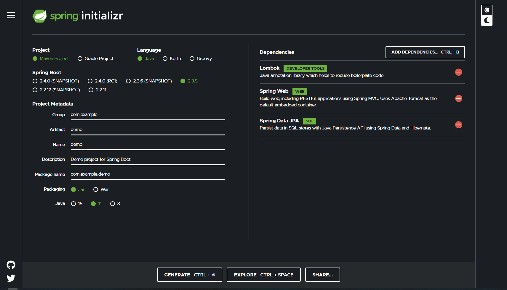

# Spring Boot 

## Prerequisites
- One of the Java versions
    - <a href="https://www.oracle.com/java/technologies/javase/javase-jdk8-downloads.html">Java SE 8 </a>
    - <a href ="https://www.oracle.com/java/technologies/javase-jdk11-downloads.html">Java SE 11 </a>
- <a href = "https://www.jetbrains.com/idea/download/">IntelliJ</a>
- <a href = "https://www.postman.com/downloads/">Postman</a>
- Depending on your database, use one of the following
    - MySQL: https://www.apachefriends.org/download.html
    - MongoDB: https://www.mongodb.com/try/download/enterprise
    
## Getting Started


1. Go to https://start.spring.io/
    - Apply the following settings
        - <b>Project</b>: Maven
        - <b>Language</b>: Java
        - <b>Group</b>: com.{project name}
        - <b>Artifact</b>: {NAME}
        - <b>Name</b>: {NAME}
        - <b>Description</b>: Spring Project (Doesn't matter)
        - <b>Package name</b>: com.{project name}
        - <b>Packaging</b>: Jar
        - <b>Java</b>: {Your version of Java installed}
    - Add the following Dependencies:
        - Lombok
        - Spring Web
        - Spring Data JPA

2. Click "Generate"
3. Unzip the download to your working directory
4. Manually add the following dependencies in pom.xml
```xml
<dependency>
    <groupId>org.springframework.boot</groupId>
    <artifactId>spring-boot-starter-validation</artifactId>
    <version>2.3.3.RELEASE</version>
</dependency>

```
- For projects using MySQL 
```xml
<dependency>
    <groupId>mysql</groupId>
    <artifactId>mysql-connector-java</artifactId>
    <scope>runtime</scope>
</dependency>
```

- For projects using MongoDB
```xml
<dependency>
    <groupId>org.springframework.boot</groupId>
    <artifactId>spring-boot-starter-data-mongodb</artifactId>
</dependency>
```

## File Structure

```bash
com/example/api
com/example/dto
com/example/entity
com/example/repository
com/example/service
com/example/utility
```

## Important Annotations

- API
    - @Autowired
    - @RestController
    - @CrossOrigin
    - @RequestMapping
    - @GetMapping
    - @PostMapping
    - @PutMapping
    - @DeleteMapping
    - @RequestBody
    - @PathVariable
    - @QueryParam

- DTO
    - @Data

- Entity
    - @Data
    - @Entity
    - @Id
    - @GeneratedValue(strategy = GenerationType.IDENTITY)
    - @Column 
    
- Repository
    - none
    
- Service
    - @Autowired
    - @Service
    - @Transactional
    
- Utility
    - ErrorInfo
        - @Data
    - ExceptionControllerAdvice
        - @RestControllerAdvice
        - @Autowired
        - @ExceptionHandler
    - LoggingAspect
        - @Component
        - @Aspect
        - @AfterThrowing


